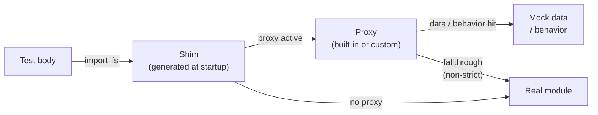

# About the mocking architecture

utest intercepts module calls without requiring any changes to the code under test — no dependency injection, no interface swaps, no test-aware code paths. This non-invasive property is the central design goal, and it shapes why the framework has three collaborating parts: a **shim**, a **proxy**, and a **mock engine**.

The diagram below shows how a call travels at runtime:

---

## Why three layers?

Each part has a single, narrow responsibility.

The **shim** only intercepts or delegates — it has no knowledge of what mock data exists or which functions should be overridden. This lets shims be generated mechanically from a module's export list.

The **proxy** only handles mock logic — it looks up data, invokes behavior overrides, enforces strict mode, and falls through to the real module. It has no knowledge of how the import was resolved, which means proxies can be swapped per-project via custom proxy factories without touching shims.

The **mock engine** only owns the layer stack and snapshot/restore cycle. It has no knowledge of any specific module, which means the same isolation guarantee applies uniformly across all proxied modules.

Collapsing any two of these into one would couple concerns that need to evolve independently.

---

## Why the layer model

`mock.inject()` pushes a layer rather than replacing the mock state outright. An inner `inject()` call can override specific keys without destroying the outer context's state, and the layer is removed automatically when the callback exits — even if the callback throws.

The alternative — a flat mutable map — would require explicit save/restore in every test that nests mocks, and a forgotten restore would silently corrupt subsequent tests.

---

## See also

- Term definitions: [Reference: Glossary](../reference/glossary.md)
- How shims are generated at startup: [About shim generation](shim-generation.md)
- How inject() and patch() differ at the shim level: [About mock.inject() vs mock.global.patch()](inject-vs-patch.md)
- The layer stack and registry internals: [About the mock engine](mock-engine.md)
