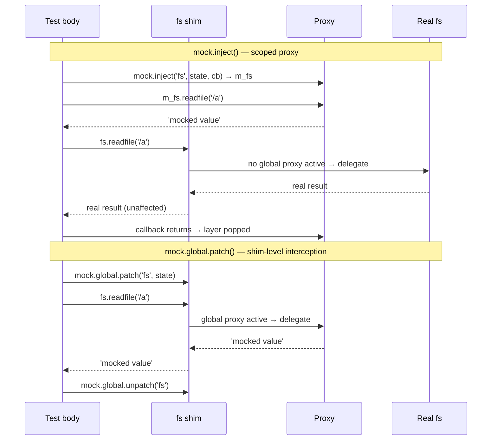

# About mock.inject() vs mock.global.patch()

utest provides two mechanisms for mocking modules: `mock.inject()` and `mock.global.patch()`. They look similar but operate at different levels, and choosing the wrong one leads to tests that appear to work but silently miss the code path you intended to exercise.

---

## The fundamental difference

`mock.inject()` affects only the proxy object it passes to the callback. The real imported binding in the test file — the one you declared with `import * as fs from 'fs'` — is completely unaffected. Code inside the callback that calls `m_fs.readfile(...)` goes through the mock; code that calls `fs.readfile(...)` reaches the real module.

`mock.global.patch()` affects the module's shim. The shim is a generated file that sits in front of the real module and is what `import * as fs from 'fs'` actually loads inside the worker process. When you patch the global state, every call to the shim — including calls made through the top-level `fs` binding in your test file — is intercepted.

The diagram below shows how each path reaches (or bypasses) the proxy:



```js
it('patches global state via mock.global.patch()', () => {
    const m_fs = mock.global.patch('fs', { data: { '/tmp/setup.txt': 'setup' } });
    assert.match('setup', m_fs.readfile('/tmp/setup.txt'));
    assert.match('setup', fs.readfile('/tmp/setup.txt'), 'shim transparently intercepts global state');
    mock.global.unpatch('fs');
});

it('injects scoped mock via mock.inject()', () => {
    mock.inject('fs', { data: { '/tmp/scoped': 'data' } }, (m_fs) => {
        assert.match('data', m_fs.readfile('/tmp/scoped'));
        assert.match(null, fs.readfile('/tmp/scoped'), 'real fs is unaffected inside callback');
    });
});
```

---

## Why two mechanisms exist

The reason there are two is that they serve different scenarios, and collapsing them into one would force every test to accept a more disruptive form of mocking than it actually needs.

`mock.inject()` is the safer default. Its effects are strictly scoped to the callback, and the layer is removed automatically when the callback exits — even if the callback throws. There is no cleanup step to forget. Because the real imported binding is unaffected, it is also impossible for an inject to accidentally intercept a call made outside the callback by other code in the same file.

`mock.global.patch()` exists for the cases where inject is genuinely not enough. The most common situation is when the code under test is not in the test file itself — it is in a module that you import, and that module has its own top-level import of the module being mocked. Since the module was imported before your test ran, the `mock.inject()` proxy was never handed to it. The only way to intercept calls made through that binding is to affect the shim that the binding was resolved from, which is what `mock.global.patch()` does.

This is a deliberate trade-off. `mock.global.patch()` is more powerful but requires manual cleanup with `mock.global.unpatch()`. The mock snapshot/restore cycle that runs around each test provides a safety net — a forgotten `unpatch()` will be caught and cleaned up — but within a single test the cleanup is your responsibility.

---

## The layering model

`mock.inject()` pushes a new layer onto a per-module layer stack. When the proxy looks up a key, it scans the stack from top to bottom and falls through to the global state if nothing matches. When the callback exits, the top layer is popped.

`mock.global.patch()` does not use the layer stack. It writes directly to the global state of the registry, which sits below all inject layers. This means a `global.patch()` is visible through any active `inject()` layer unless a layer explicitly overrides the same key.

---

## Next steps

- Decide when to use each mechanism: [How-to: Patch global state with mock.global.patch()](../how-to/mock-global-patch.md)
- Walk through a complete inject example: [How-to: Mock a module with mock.inject()](../how-to/mock-inject.md)
- Understand how mock state survives across tests: [About test isolation](test-isolation.md)
- Make unmocked access fail loudly: [About strict mode](strict-mode.md)
