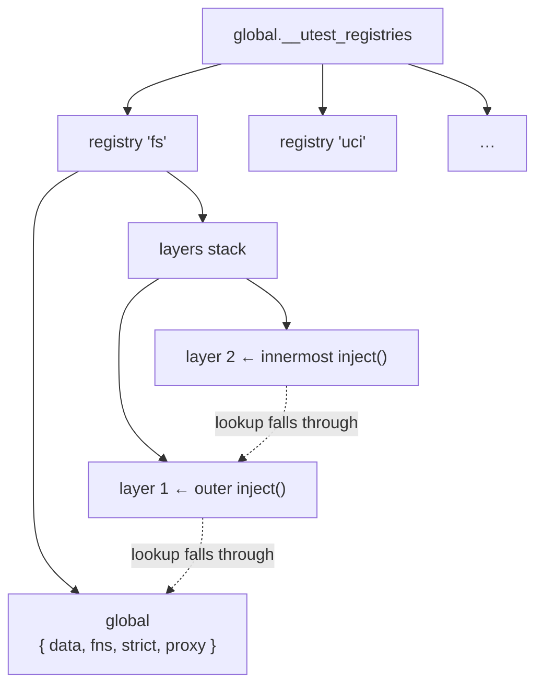

# About the mock engine

The mock engine is the machinery behind `mock.inject()` and `mock.global.patch()`.
It lives in `src/utest/mock/engine.uc` and exposes two global objects:
`__utest_mock_instance` (the public `mock` API used by tests) and
`__utest_internal_instance` (the lower-level API used by proxies).

---

## One registry per module

The engine stores state in `global.__utest_registries`, a plain object keyed by
module name. Each registry looks like this:

```js
{
    name: "fs",
    layers: [],
    global: { data: {}, fns: {}, strict: false, proxy: null }
}
```

Registries are created lazily on first access. Because `global.__utest_registries`
is a JavaScript global, it persists for the lifetime of the worker process and
is shared by every module that `require()`s `engine.uc` in the same interpreter.
This is intentional: it is how the shim, the proxy, and the test body all see
the same state without being directly coupled.



---

## The layer stack: how inject() works

`mock.inject(name, state, cb)` pushes a new layer onto `registry.layers` before
calling `cb`, then pops it when `cb` returns (or throws). A layer is a snapshot
of the `state` argument:

```js
{ data: { ...state.data }, fns: { ...state.behavior }, strict: state.strict }
```

Layers are a stack, not a flat map. `get_data` and `get_fn` search from the top
of the stack downward, then fall back to `registry.global`. This means `inject()`
calls can nest: an inner `inject()` that sets `data.x = 2` shadows an outer
`inject()`'s `data.x = 1` without modifying it. When the inner callback returns,
its layer is popped and the outer value is visible again.

`set_data` always writes to the innermost active layer (the top of the stack).
If no layers are active it writes to global state, which is the behaviour used
by `mock.global.patch()`.

---

## Global state: how patch() works

`mock.global.patch(name, state)` writes directly to `registry.global` and builds
a proxy, storing it as `registry.global.proxy`. The shim reads `global.proxy` via
`__internal__.get_proxy_global(name)` on every call. This is the mechanism that
allows production code — code that has already imported the shim — to have its
module calls intercepted transparently, without the test body holding a reference
to the proxy object.

`mock.global.unpatch(name)` resets `registry.global` to empty and clears the
stored proxy. If `unpatch()` is not called explicitly, `mock.restore()` will
clean it up.

---

## Snapshot and restore: automatic cleanup between tests

Before running the first test, the worker runner takes a snapshot of all
registries:

```js
const mock_snap = mock.snapshot();
```

`snapshot()` captures the `data`, `fns`, `strict`, and `proxy` of every
registry's `global` at that moment. After each test, `mock.restore(mock_snap)`
resets all layers to empty and restores every registry's global to the snapshotted
values. This means:

- A test that calls `mock.global.patch()` without calling `unpatch()` does not
  leak state to the next test.
- A test that modifies global data via `set_data()` does not affect subsequent
  tests.
- If a test throws mid-way through a mock operation, cleanup still happens because
  `restore()` is called unconditionally after the test body.

The runner takes a second snapshot after `beforeEach` hooks run and before the
test body. If the test body throws, this second snapshot is restored immediately
so that `afterEach` hooks see clean mock state.

---

## The proxy building chain

When `inject()` or `patch()` needs a proxy object, it calls the internal
`build_proxy(name, real)` function. This function:

1. Calls `proxy_base.context(name, real)` to create the `ctx` object that exposes
   the engine's registry operations for `name`.
2. Attempts `require('utest.mock.proxy.' + name)` to find a module-specific
   proxy factory. If the shim dir or the proxy dir is in the `-L` path, user or
   built-in proxy files will be found here.
3. If a factory is found, calls `factory.create(name, real, ctx)` and returns the
   result.
4. If no factory is found, falls back to `ctx.base()`, which wraps every exported
   function of `real` with a generic behavior-override check.

The `real` argument to `build_proxy` is loaded by `get_real(name)`. Because the
shim for `name` is already on the search path when the worker starts, a plain
`require(name)` would find the shim — which is an ES-module and fails in program
mode. `get_real` tries `require('real_' + name)` first, which resolves to the
symlink the shim generator created alongside the shim, pointing to the actual
module file.
