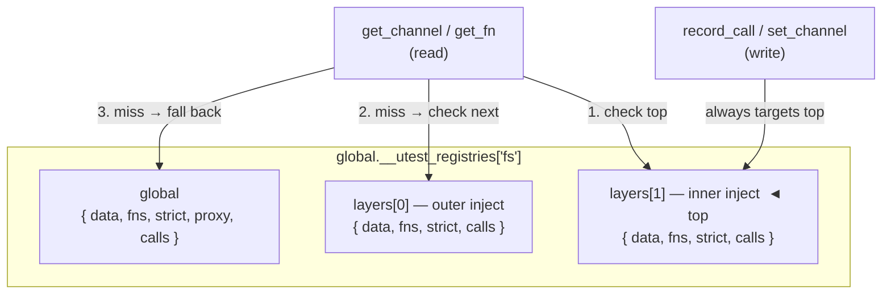

# About the mock engine

The mock engine owns two things: the per-module state registry and the
snapshot/restore cycle that keeps tests isolated from each other. Understanding
why it is structured the way it is makes the mock API's behaviour — especially
around nested `inject()` calls and forgotten `unpatch()` calls — predictable.

---

## Why one registry per module

The shim, the proxy, and the test body are three separate objects that need to
share the same mock state without being directly coupled to each other. A global
registry keyed by module name is the simplest structure that satisfies this:
the shim asks "is there a proxy for `fs`?" by name, the proxy reads and writes
data by name, and the test body addresses everything by name. None of the three
needs to hold a reference to either of the others.

The registry is stored as `global.__utest_registries` so it persists for the
lifetime of the worker process and is visible to every module loaded into the
same interpreter, regardless of import order. Registries are created lazily —
a module that is never mocked in a given test file never gets a registry entry.

---

## Why `inject()` uses a stack instead of replacing state

When a test calls `mock.inject('fs', state, cb)`, the engine *pushes* a new
layer rather than overwriting the current state. This means nested `inject()`
calls work correctly: the inner layer shadows the outer one for keys it
defines, and the outer values become visible again the moment the inner
callback returns.

If the engine used a flat mutable map instead, every test that needed to nest
mocks would have to save and restore state manually. A missed restore would
silently corrupt every test that ran after it. The stack makes restore
automatic and unconditional — even when the callback throws.

`set_data` always writes to the top of the stack (the innermost active layer).
`get_data` and `get_fn` search from top to bottom and fall back to global
state. This means an inner inject can add a key without knowing or affecting
what the outer inject declared.

---

## Why `patch()` writes to global state, not a layer

`mock.global.patch()` is designed for the case where production code already
holds an imported binding to the shim. A layer pushed by `inject()` is only
visible to the proxy object passed to the callback — it does not affect the
shim's global slot. `patch()` writes to the global slot that the shim reads on
every call, which is the only way to intercept calls made through a binding
that was resolved before the test body ran.

This is why `patch()` requires a matching `unpatch()`: there is no callback
scope to pop from. The snapshot/restore cycle provides the safety net — a
forgotten `unpatch()` is cleaned up automatically between tests.

---

## Why snapshot/restore runs around every test

Mock state is global within a worker process. Without a reset between tests,
a `global.patch()` that is not explicitly unpatched would affect every
subsequent test in the file. Even a correct test that calls `unpatch()` might
crash before reaching it, leaving state dirty.

The runner takes a snapshot before each test body and restores it
unconditionally after the test (and after `afterEach` hooks). The sequence is:

1. Run `beforeEach` hooks.
2. Snapshot global mock state.
3. Run the test body.
4. If the test threw, restore the snapshot immediately so `afterEach` sees clean state.
5. Run `afterEach` hooks.
6. Restore the snapshot unconditionally.

This two-phase restore (step 4 and step 6) guarantees that `afterEach` hooks
always run in a predictable mock environment, even when the test itself leaked
a patch.

---

## The proxy building chain

When `inject()` or `patch()` needs a proxy, it resolves one in priority order:

1. A user-supplied proxy factory found via `require('utest.mock.proxy.' + name)`.
2. A built-in proxy factory (same path, ships with utest).
3. A generic passthrough wrapper around every exported function of the real module.

This means a project can override any built-in proxy by placing a file at the
right path without modifying the framework. The resolution is the same
`require()` mechanism used everywhere else in ucode — no special registry.

---

## See also

- How the shim is generated before workers start: [About shim generation](shim-generation.md)
- The public `ctx` API exposed to proxy factories: [Proxy context API reference](../reference/contributor/proxy-ctx-api.md)
- How the layer model looks from a test author's perspective: [About mock.inject() vs mock.global.patch()](inject-vs-patch.md)
