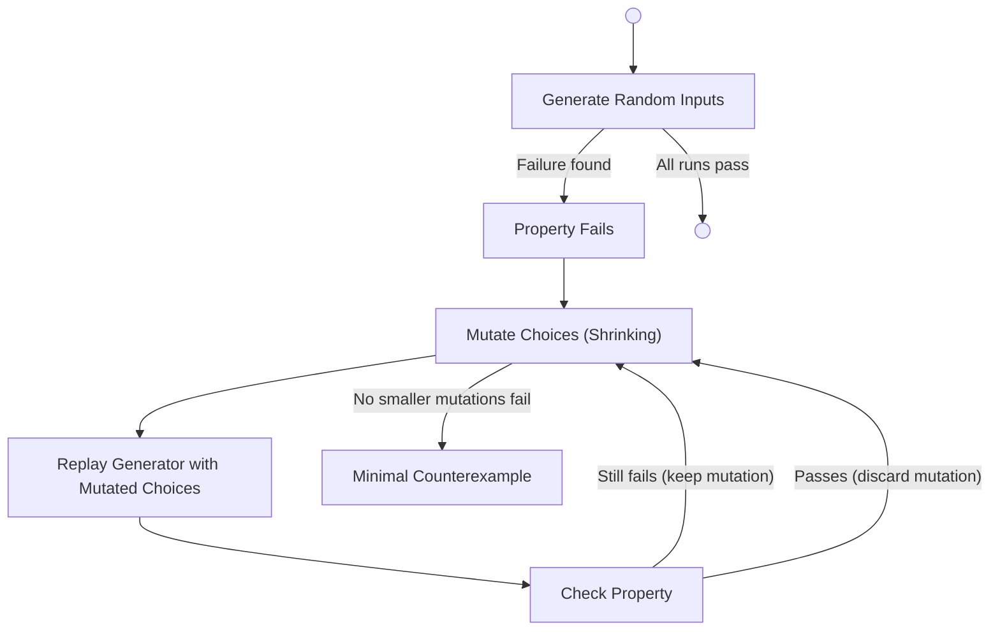

# About property-based testing

Property-based testing is a methodology that evaluates code against a wide range of randomly generated inputs to verify general invariants ("properties") rather than checking a few manually chosen examples. 

---

## The limits of example-based testing

In standard example-based testing, you supply a few inputs and expect specific outputs. For a `clamp(value, min, max)` function, you might write:
- `clamp(5, 0, 10) == 5`
- `clamp(-5, 0, 10) == 0`
- `clamp(15, 0, 10) == 10`

While useful, this relies entirely on the test author's imagination to anticipate edge cases. If the author forgets to test negative bounds or reversed ranges, bugs hide in the gaps.

---

## Testing properties

Property-based testing addresses this by testing general rules. Instead of hardcoding inputs, you declare what must be true for *all* inputs. For `clamp`, a property would be:

*For any integers `value`, `lo`, and `hi`, the result of `clamp` must be between `lo` and `hi`.*

The framework then generates hundreds of random `(value, lo, hi)` combinations and asserts the property holds for every single one. If it finds a counterexample, the property fails.

---

## The generation model

Randomness in utest is managed carefully to ensure deterministic behavior and effective bug discovery. 

Generators don't call the system random number generator directly. Instead, the framework passes them a `source` object seeded from the clock. This allows the framework to record exactly what random choices were made to produce a specific value, which is crucial for reproducing failures.

Generators are also biased toward edge-case values. When testing `gen.int(-100, 100)`, a purely uniform distribution is unlikely to hit `0`, `-100`, or `100` frequently. utest deliberately overweights these "zero points" — the values closest to `0` or the range boundary — so common sources of off-by-one and boundary bugs surface faster than chance alone would allow. See [Property-based testing reference](../reference/property.md) for the exact bias mechanics.

---

## Shrinking

A counterexample found by a random generator is often large, noisy, and difficult to debug. For instance, discovering a bug in `clamp` with the input `(-47, 91, 12)` is less helpful than knowing it fails for `(0, 1, 0)`.

**Shrinking** is the automated process of reducing a failing input to its minimal possible form.

When a property fails, the framework stops generating new inputs and begins a greedy shrinking algorithm on the recorded sequence of random choices that produced the failing value. 

### How the shrinker works

Because the shrinker mutates the underlying sequence of random choices rather than the generated ucode value itself, it works universally for any composition of generators without requiring type-specific shrinking logic.

The shrinker attempts several strategies iteratively, adopting any mutation that produces a smaller failure:

1. **Deletion**: Deleting choices collapses lengths (e.g., shrinking arrays).
2. **Sorting**: Sorting prefixes canonicalizes order.
3. **Swapping**: Swapping adjacent out-of-order pairs performs local reordering.
4. **Lowering**: Binary searching individual choice values toward `0` reduces magnitudes (e.g., shrinking large integers to small ones).
5. **Redistribution**: Redistributing weight between two choices preserves sums while finding simpler boundaries.

This continues until a full pass finds no smaller failure, yielding a minimal, highly debuggable counterexample.
