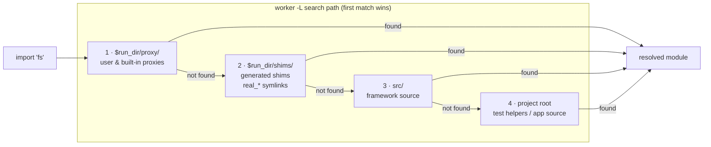

# About shim generation

Shims are the bridge between the static import system and the dynamic mock
engine. Understanding why they exist, and how they are built, explains the
requirement for a config file whenever a module needs to be mockable.

---

## Why shims are necessary

ucode's `import` statement is resolved at compile time, before the test file
runs. When a test file says:

```js
import * as fs from 'fs';
```

ucode resolves and compiles `fs` immediately. By the time the test body calls
`mock.inject('fs', ...)`, the `fs` name in the test file already refers to the
real module object — there is no runtime hook point.

A shim solves this by inserting a thin ES-module between the test file and the
real module. The shim is placed in a directory that is prepended to the worker's
`-L` search path, so the worker finds the shim before it finds the real module.
Every function call that would have gone to `fs` goes to the shim instead. The
shim checks on every call whether a proxy is active and, if so, delegates to it.
If no proxy is active, the shim delegates to the real module as if it were not
there.

---

## How `manager.uc` generates standard shims

The coordinator calls `MockManager.setup(config)` before spawning any workers.
For each module name in `config.mocks`, `setup_shim(name, shim_dir)` runs:

1. It checks the ucode module search path (`REQUIRE_SEARCH_PATH`) for the real
   module file.

2. If the real module is found, `generate_standard_shim(name, shim_dir)` is
   called. This function `require()`s the real module (in the coordinator process,
   where no shim is yet on the path), inspects its exported keys, and writes an
   ES-module that looks like:

```js
import * as _real from 'real_fs';
import { __internal__ } from 'utest.mock.engine';

export const readfile = function(...args) {
    let p = __internal__.get_proxy_global('fs');
    return p ? p.readfile(...args) : _real.readfile(...args);
};
export const writefile = function(...args) {
    let p = __internal__.get_proxy_global('fs');
    return p ? p.writefile(...args) : _real.writefile(...args);
};
// ... one entry per exported function
```

   Non-function exports are re-exported as simple assignments
   (`export const X = _real.X`).

3. A symlink `real_<name>.uc` is created in the shim directory, pointing at the
   real module file. This allows `engine.uc`'s `get_real()` helper to load the
   real module by requiring `real_fs` rather than `fs`, avoiding the shim.

---

## Stub shims for absent modules

Some modules — `uloop`, `uclient` — are not present on every rootfs variant.
The coordinator cannot inspect a module that does not exist, so it cannot generate
a standard shim.

If the built-in proxy for the module declares an `api` array (as `uloop.uc` and
`uclient.uc` do), the manager generates a stub shim instead. A stub shim contains
only the functions listed in `api` and always delegates to the active proxy; it
has no real-module fallback:

```js
import { __internal__ } from 'utest.mock.engine';

export const init = function(...args) {
    let p = __internal__.get_proxy_global('uloop');
    if (p) return p.init(...args);
};
export const timer = function(...args) {
    let p = __internal__.get_proxy_global('uloop');
    if (p) return p.timer(...args);
};
// ...
```

Without `api`, the module is left unshimmed when absent. Importing it in a test
file then fails at worker startup.

---

## Why the shim directory is prepended to the search path

The worker is launched with the shim directory first in its `-L` flag list. ucode
resolves modules in search-path order, so the shim shadows the real module at the
path level — no changes to the test file or the real module are needed.

The proxy directory (`$run_dir/proxy/`) is prepended before the shim directory.
This ensures that a user-supplied proxy (configured via `{ proxy: 'path' }` in
`config.mocks`) shadows any built-in proxy of the same name. The full search
order seen by a worker is therefore:

1. `$run_dir/proxy/` — user proxies and, transitively, built-in proxies via the
   `utest.mock.proxy.*` namespace
2. `$run_dir/shims/` — generated shims and `real_<name>` symlinks
3. `src/` — utest framework source
4. project root — test helpers and application source


