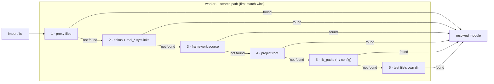

# About shim generation

Shims are the bridge between the static import system and the dynamic mock
engine. Understanding why they are necessary, and what constraints their
design must satisfy, explains why a config file is required before a module
can be mocked.

---

## Why shims are necessary

ucode's `import` statement is resolved at compile time, before the test file
runs. When a test file says:

```js
import * as fs from 'fs';
```

ucode resolves and compiles `fs` immediately. By the time the test body calls
`mock.inject('fs', ...)`, the `fs` name already refers to the real module
object — there is no runtime hook point.

A shim solves this by inserting a thin ES-module between the test file and the
real module. The shim is placed in a directory that is prepended to the
worker's module search path, so the worker finds the shim before it finds the
real module. Every call that would have gone to `fs` goes to the shim instead.
The shim checks on every call whether a proxy is active; if one is, it
delegates to it; if not, it delegates to the real module unchanged.

---

## Why the config file is required

The shim must be generated before any worker starts, because workers compile
their imports at load time. The coordinator generates shims during its startup
phase, before spawning any workers.

To generate a shim for a module, the coordinator needs to know two things:
which modules to shim, and what functions those modules export. The `mocks`
key of `utest.config.uc` provides the first. For the second, the coordinator
loads the real module in its own process (where no shim is yet on the path)
and inspects its exports. A shim is then written that re-exports each function
with a proxy check inserted around the call.

This is why adding a new module to `mocks` takes effect immediately with no
other changes: the coordinator generates the shim automatically from the live
module's export list.

---

## Stub shims for absent modules

Some modules — `uloop`, `uclient` — are not present on every rootfs variant.
The coordinator cannot inspect a module that does not exist, so it cannot
generate a shim from its exports.

For these modules, the built-in proxy declares an explicit `api` list. The
coordinator uses that list to write a stub shim — one that contains only the
listed functions and always routes through the proxy with no real-module
fallback. The module can be imported and mocked in tests even when it is not
physically present on the system running the tests.

Without an `api` list, an absent module is left unshimmed. Importing it in a
test file fails at worker startup.

---

## Why the shim directory is prepended to the search path

The shim must shadow the real module at the path level so no changes to the
test file or to the production code are required. Prepending the shim
directory to the worker's search path achieves this: ucode resolves modules
in order and picks the first match.

The full search order seen by a worker is:

1. User and built-in proxy files
2. Generated shims and real-module symlinks
3. utest framework source
4. Project root (test helpers and application source)
5. `lib_paths` (from `-l` and config)
6. The test file's own directory

Tiers 5 and 6 are appended at the end deliberately: a `-l` directory or a
helper sitting next to the test file must never outrank the shims (tier 2), or
a coincidentally same-named file could silently defeat a mock. This is also why
naming your own module after a ucode built-in (`math`, `fs`, …) fails — the
built-in resolves before these low-priority tiers.

A `real_<name>` symlink is written alongside each shim, pointing at the
actual module file. This allows the proxy to load the real module by requiring
`real_fs` rather than `fs`, bypassing the shim.



---

## Intercepting require() in program-mode code

Shims cover `import` statements. They do not help when code under test loads a module at runtime with `require('fs')` — `require()` is a function call that resolves against the module cache and is not affected by what is on the `-L` search path in the same way as compile-time imports.

To close this gap, the worker installs a `require()` override in `bootstrap.uc` before the test file is loaded. The override checks whether the requested module has an active global proxy, and returns it directly if so. Only modules declared in `mocks` are checked; all other `require()` calls are passed through to the original built-in unchanged.

```
require('fs')
    │
    ▼
global.require override
    ├─ global proxy active? ──yes──▶ return proxy
    │
    ├─ module in mocks?
    │     ├─ yes ──▶ try require('real_fs')  ─── found ──▶ return real module
    │     │                                  └── not found ──▶ fall through
    │     └─ no ──▶ fall through
    │
    └─ return _real_require(name)   (original built-in)
```

The `real_<name>` symlink that the coordinator places alongside each shim gives the override a way to reach the real module when no proxy is active — the same symlink that `get_real()` in the mock engine already uses. This avoids the override accidentally loading the ES-module shim (which `require()` cannot compile) when a mocked module is requested but not currently patched.

The two mechanisms — shim for `import`, override for `require()` — both route to the same proxy object, so `mock.global.patch()` covers code under test regardless of how it loads its dependencies.

---

## See also

- Why calling the same module from production code requires `mock.global.patch()`: [About mock.inject() vs mock.global.patch()](inject-vs-patch.md)
- How the mock engine uses the generated proxy: [About the mock engine](mock-engine.md)
- How to add a proxy for a new module: [How-to: Add a built-in proxy](../how-to/contributor/add-proxy.md)
