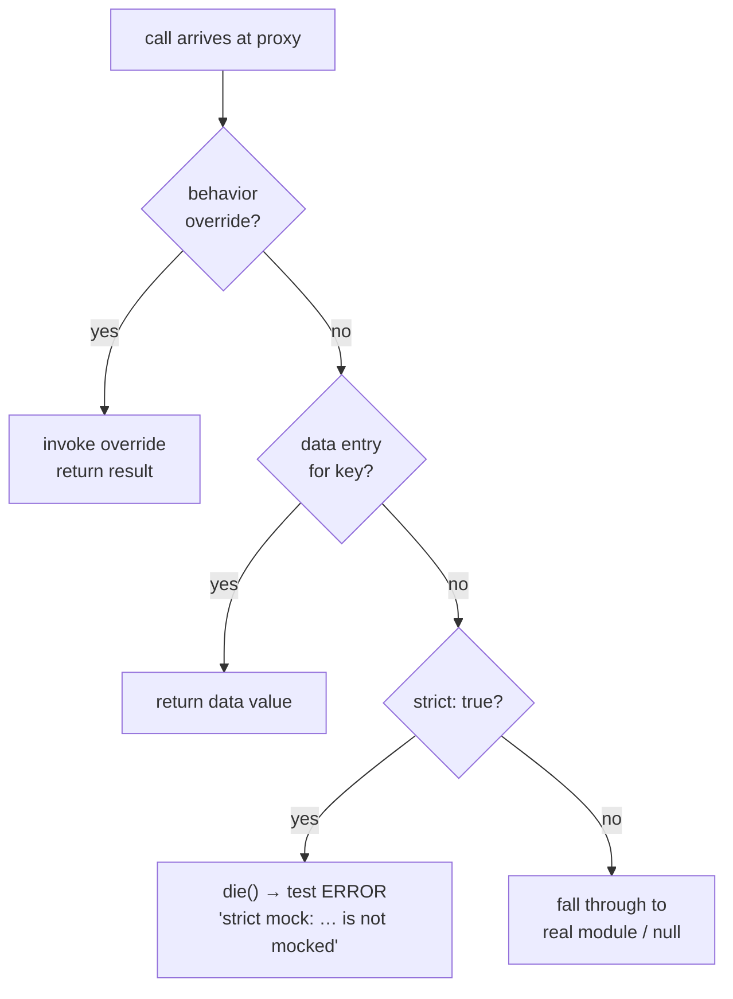

# About strict mode

Strict mode changes what happens when code calls a proxied function for a module key that has no mock configured: instead of silently returning `null`, utest calls `die()` immediately, which the test runner catches and reports as an `ERROR` (a raw `die()`, not an assertion failure, so it is classified as an error rather than a `FAIL`).

---

## What strict mode does

Every mock proxy sits in front of a real module. When a call arrives for a function that has no overridden behavior and no data entry, the proxy normally falls through to the real module implementation. If the real module is unavailable (for example, a hardware module that does not exist in the Docker environment), the fallthrough returns `null`.



With strict mode enabled, there is no fallthrough. Any call whose key is not explicitly covered by the mock configuration causes an immediate `die()`. The message always begins `strict mock:` and names the module and the missing key; the exact wording is proxy-specific, for example:

```
strict mock: uci package 'no-pkg' is not mocked
```

The test runner catches this and marks the test as `ERROR` with that message. No other tests are affected.

Strict mode is enabled by setting `strict: true` in the state object passed to either `mock.inject()` or `mock.global.patch()`:

```js
mock.inject('uci', {
    strict: true,
    data: {
        'system': {
            '@system[0]': { '.type': 'system', 'hostname': 'myrouter' }
        }
    }
}, (m_uci) => {
    assert.match('myrouter', m_uci.cursor().get('system', '@system[0]', 'hostname'));
    // Any call for an unmocked package will die() here.
});
```

---

## Why it exists

Without strict mode, a missing mock setup is silent. The code under test receives `null` where it expected a real value, produces wrong output, and the test either passes incorrectly (if the wrong output happens to satisfy a loose assertion) or fails with a confusing error message unrelated to the actual cause.

Strict mode makes the gap explicit. If the code under test touches a path you did not anticipate, you know immediately — and the error message names the exact key that was missing. This is far more useful than chasing a `null` dereference five stack frames away.

The choice not to make strict mode the default was also deliberate. Strict mode requires you to enumerate every key the code under test will access. For broad integration tests that exercise many code paths through many modules, that enumeration is impractical and fragile — adding a new feature should not require updating mock lists in unrelated tests. Strict mode therefore works best when the scope is narrow and the set of accessed keys is known and stable.

---

## The trade-off

Strict mode makes tests more brittle in proportion to the number of paths the code touches. Every new call to the mocked module that was not anticipated at test-writing time will cause a failure until the data map is updated. This is a feature in narrow unit tests — you want to know — and a liability in broad integration tests — you do not want every feature addition to break existing tests.

A side effect of this property is that the `data` map of a strict mock becomes a living specification of what the code under test is expected to access. The test fails not only when an assertion is wrong but also when the code reaches for something it was not supposed to.

For a workflow that uses this trade-off deliberately, see [How-to: Use strict mode](../how-to/strict-mode.md).

---

## Next steps

- Understand the two mock mechanisms and when to use each: [About mock.inject() vs mock.global.patch()](inject-vs-patch.md)
- See how mock state is restored after a failed test: [About test isolation](test-isolation.md)
- Walk through a complete inject example: [How-to: Mock a module with mock.inject()](../how-to/mock-inject.md)
