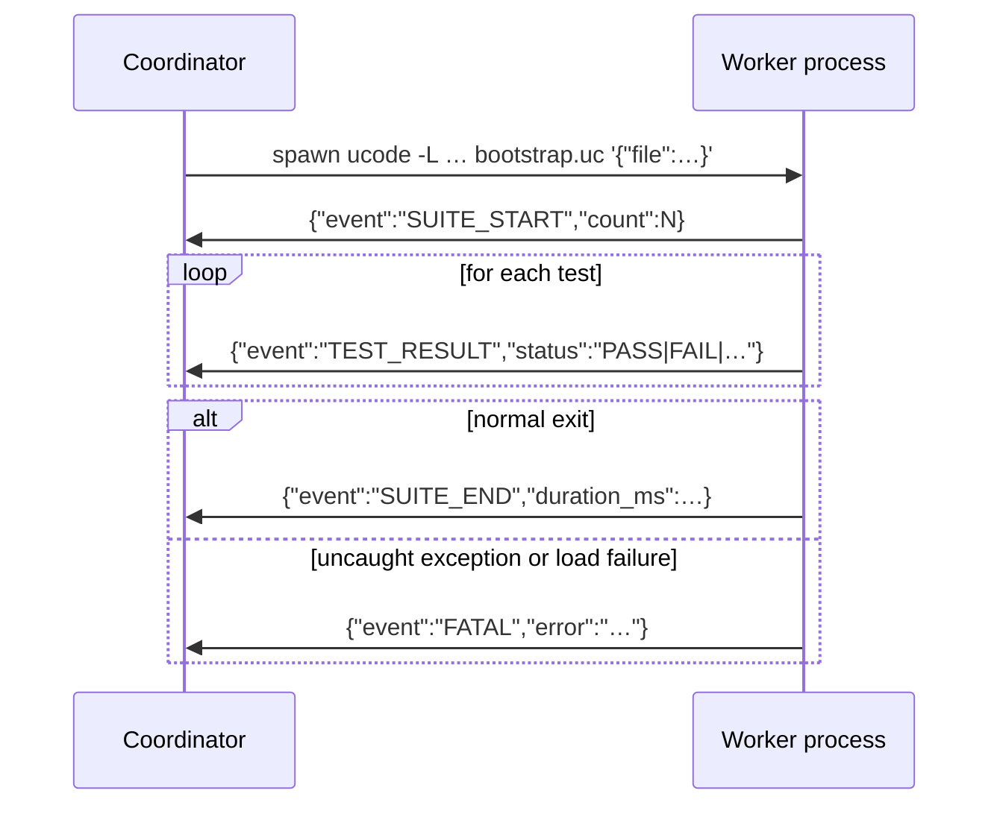
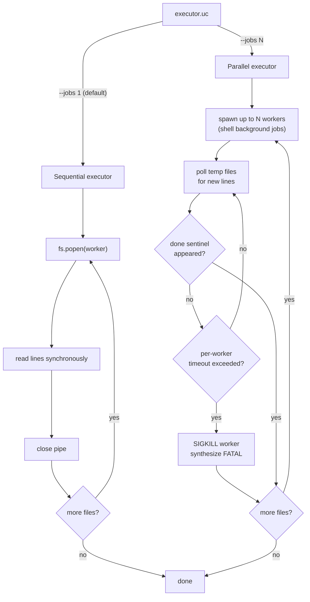

# About the worker/coordinator architecture

utest runs each test file in a separate ucode subprocess. Understanding why, and
how the two sides communicate, makes it easier to reason about failures, timeouts,
and reporter output.

---

## Why subprocesses?

ucode has no threads and no exception isolation between modules loaded into the
same interpreter instance. If a test file crashes — an uncaught exception, a
`die()` call outside a test body, a corrupt global — the crash would take the
entire test run with it.

Running each file in its own subprocess means the blast radius of any single
failure is bounded to that file. The coordinator receives a FATAL event, marks
the file as errored, and continues with the remaining files. A crash in
`09_standard_shim_test.uc` cannot prevent `10_aftereach_guarantee_test.uc` from
running.

Subprocess isolation also gives each test file a clean address space. Global
variables, imported module state, and any monkey-patching done by one file
cannot bleed into another file's execution.

---

## How the coordinator discovers files

The coordinator is the process started by `src/utest/cli.uc`. It:

1. Parses bundle arguments from the command line (`[Name:]path`).
2. For each bundle, calls `utest.runner.discovery.find_files(pattern)`, which
   runs `fs.glob()` and sorts the results.
3. Passes the file list to `utest.runner.executor.execute_suites()`.

Before spawning any workers, the coordinator calls `MockManager.setup()` to
generate shim files for every module listed in `config.mocks`. The shim
directory is then prepended to every worker's `-L` search path.

---

## How workers are spawned and how output flows back

Each worker is a fresh `ucode` invocation:

```bash
ucode -L <shim_dir> -L <src_dir> -L <cwd> \
      src/utest/runner/worker/bootstrap.uc \
      '{"file":"...","filter":"...","bundle":"...","seed":...}'
```

`bootstrap.uc` receives the JSON argument, loads the test file with
`loadfile()`, then calls `worker_runner.run_tests()`. The worker reporter in
`src/utest/runner/worker/reporter.uc` writes JSON objects to stdout — one per
event, terminated by a newline. The coordinator reads those lines and routes them
to the coordinator-side reporter.



---

## Sequential vs parallel executor

The executor choice is made by `src/utest/runner/executor.uc` based on the
`--jobs` flag:

**Sequential** (`--jobs 1`, the default): opens each worker with `fs.popen()`,
reads lines from the pipe synchronously, closes the pipe before starting the
next worker. Output arrives in the order tests run. No temporary files are
involved.

**Parallel** (`--jobs N`): launches up to N workers simultaneously using shell
background jobs. Each worker's stdout is redirected to a temporary file in
`$run_dir/pipes/`. The coordinator polls those files in a loop, advancing a
byte offset as new complete lines appear. A `done` sentinel file signals that a
worker has exited. The coordinator enforces a per-worker wall-clock timeout
(default 60 seconds, configurable with `--timeout`); a worker that exceeds it
is killed with `SIGKILL` and a synthetic FATAL event is emitted.

The trade-off: sequential is simpler and produces interleaved output in a single
stream; parallel reduces total wall time for slow test suites but requires
polling and temporary storage.

---

## Why the parallel executor polls at a fixed 50 ms interval

The coordinator wakes every 50 ms to read new output from active workers. This
is a deliberate choice, not a placeholder for a future event-driven
implementation.

### Why not block on file descriptors?

The natural alternative is to block on a file descriptor until a worker writes
something — the same mechanism the sequential executor uses with `fs.popen()`.
Two standard approaches exist, and neither is available here:

**inotify / kqueue**: OS APIs that wake a process when a file changes. Neither
is exposed by ucode's standard library. Adding a native extension would work,
but it would introduce a C dependency that must be rebuilt for every new OpenWrt
SDK version — significant maintenance cost for a test tool that is supposed to
require nothing beyond ucode itself.

**Named pipes (FIFOs)**: `fs.popen()` gives the sequential executor a blocking
pipe handle. In principle the parallel executor could open a FIFO per worker
instead of a regular file. The obstacle is the worker spawn command:

```bash
( ucode … > out_file 2>&1 & echo $! > pid_file; wait; touch done_file ) &
```

The outer subshell is detached (`&`), so the coordinator never holds a file
descriptor to it. This structure was chosen because it lets the coordinator
kill the worker on timeout with a single `kill -9 $pid` aimed at the ucode
process directly — a FIFO-based protocol would require a different spawn
strategy and a different teardown path, adding complexity with no other benefit.

### Why 50 ms specifically?

The sleep fires at most 20 times per second, only while work remains. The
overhead is bounded by job count, not by test count:

| Jobs | Polls / sec | File ops / sec |
| ---- | ----------- | -------------- |
| 1    | 20          | 20             |
| 4    | 20          | 80             |
| 8    | 20          | 160            |

On the target hardware — OpenWrt routers and SDK containers running on MIPS or
ARM Cortex-A — 160 file operations per second is invisible in any profiler.

The 50 ms value sits between two thresholds:

- **Above ~5 ms per wake**: at 4–8 jobs, polling overhead becomes measurable
  on low-power embedded hardware.
- **Below ~100 ms per wake**: reporter output feels live to a human watching
  the terminal. Lines appear as a stream, not in visible bursts.

50 ms is 20× below the human perception threshold and 10× above the embedded
overhead threshold. There is no value in making it tunable at runtime: the
sweet spot is wide enough that changing it would never make a practical
difference.

### The actual worst case

The only scenario where 50 ms polling is a noticeable cost is a suite of many
very fast test files. If 20 files each take 10 ms, the parallel run finishes
in ~10 ms of actual work, but the coordinator may sleep up to 50 ms after the
last file completes before detecting it. In practice, test files on OpenWrt
hardware load modules, build mock state, and run assertions — sub-20 ms per
file is rare. The detection lag is a rounding error in any realistic suite.



---

## The FATAL event

FATAL is the "something went catastrophically wrong" signal. It can originate
from three places:

- **The worker itself** (`bootstrap.uc`): if `loadfile()` fails, or if the test
  file throws an uncaught exception during the module-level evaluation phase, or
  if `setup()` / `teardown()` throws. The worker prints the FATAL JSON line and
  exits with code 1.
- **Timeout** (parallel executor, coordinator side): if a worker exceeds its
  wall-clock timeout, the coordinator kills it with `SIGKILL` and synthesises a
  FATAL event.
- **Spawn failure** (parallel executor, coordinator side): if the worker process
  exits without having produced any valid JSON output — for example because
  `ucode` was not found on `PATH`, or because the worker binary crashed before
  writing anything — the coordinator reads whatever the shell wrote to
  `out_file` and reports it as a FATAL. This distinguishes a spawn failure (zero
  output) from a test file that runs and reports results normally.

After a FATAL, that suite produces no TEST_RESULT or SUITE_END events. Reporters
count fatals separately from errors and failures, and the run exits with a
non-zero code if any fatals occurred.
