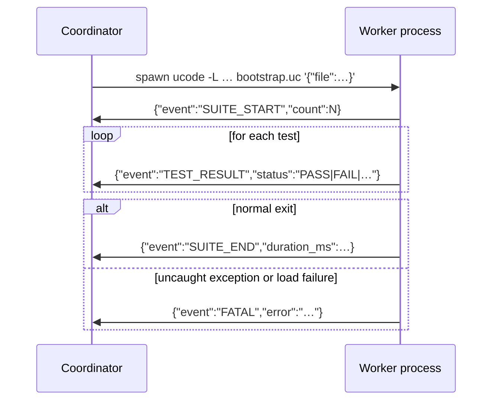
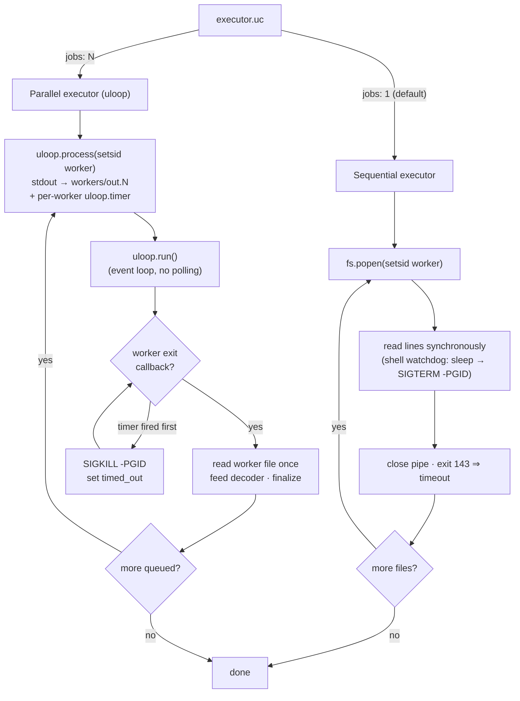

# About the worker/coordinator architecture

utest runs each test file in a separate ucode subprocess. Understanding why, and
how the two sides communicate, makes it easier to reason about failures, timeouts,
and reporter output.

---

## Why subprocesses?

ucode has no threads and no exception isolation between modules loaded into the
same interpreter instance. If a test file crashes — an uncaught exception, a
`die()` call outside a test body, a corrupt global — the crash would take the
entire test run with it.

Running each file in its own subprocess means the blast radius of any single
failure is bounded to that file. The coordinator receives a FATAL event, marks
the file as errored, and continues with the remaining files. A crash in
`10_standard_shim_test.uc` cannot prevent `03_aftereach_guarantee_test.uc` from
running.

Subprocess isolation also gives each test file a clean address space. Global
variables, imported module state, and any monkey-patching done by one file
cannot bleed into another file's execution.

---

## How the coordinator discovers files

The coordinator parses each bundle argument from the command line (`[Name:]path`),
expands any directory paths using the active glob pattern, and sorts the resulting
file list for stable ordering.

Before spawning any workers, the coordinator runs the shim generator, which
produces a shim file for every module listed in `config.mocks` and places them in
a temporary directory. That directory is then prepended to every worker's `-L`
module search path so the shims shadow the real modules. See
[Reference: Source layout](../reference/contributor/source-layout.md) for which
modules implement each phase.

---

## How workers are spawned and how output flows back

Each worker is a fresh `ucode` invocation:

```bash
ucode -L <shim_dir> -L <src_dir> -L <cwd> \
      src/utest/runner/worker/bootstrap.uc \
      '{"file":"...","filter":"...","bundle":"...","seed":...,"mocks":["fs","uci"]}'
```

`bootstrap.uc` receives the JSON argument. Before loading the test file it installs a `require()` override that routes calls to declared mock modules through their active global proxy (if any), complementing the shim mechanism that covers `import` statements. It then loads the test file with `loadfile()` and calls `worker_runner.run_tests()`. The worker reporter in
`src/utest/runner/worker/reporter.uc` writes JSON objects to stdout — one per
event, terminated by a newline. The coordinator reads those lines and routes them
to the coordinator-side reporter.



---

## Sequential vs parallel executor

The executor choice is made by `src/utest/runner/executor.uc` based on the
`jobs` configuration key:

**Sequential** (`jobs: 1`, the default): opens each worker with `fs.popen()`,
reads lines from the pipe synchronously, closes the pipe before starting the
next worker. Output arrives in the order tests run. No temporary files are
involved.

**Parallel** (`jobs: N`): drives the whole worker fleet through the ucode
`uloop` event loop — there is no polling loop and no fixed wake interval. It
starts up to N workers with `uloop.process`, and each worker's stdout is
redirected to its own file under `$run_dir/workers/`. When a worker exits,
uloop invokes its process callback; the coordinator reads that worker's file
**once, in full**, feeds it to the shared decoder, then starts the next queued
file. Because a worker's entire output is decoded in a single callback, one
suite's events never interleave with another's. A per-worker `uloop.timer`
enforces the wall-clock timeout (default 60 seconds, configurable via `timeout`
in `utest.config.uc`); on expiry the worker is killed and its exit callback
finalizes with whatever partial output reached the file.

Because the parallel executor is built entirely on `uloop`, `jobs > 1` requires
the ucode `uloop` module to be present — there is no polling fallback. Running
`-j 1` (the default) never touches `uloop`, so the module stays a soft
dependency for minimal images.

The trade-off: sequential is simpler, streams output live line-by-line, and
needs no `uloop`; parallel reduces total wall time for slow suites but decodes
each suite only at worker exit (so its output is contiguous-per-suite rather
than live-per-line).

---

## Why the timeout kill targets the process group

A hung worker is killed on timeout, but a test may have spawned children of its
own (a popen'd daemon, a background `system(... &)`). Killing only the worker
PID would leave those children alive: under the sequential executor a surviving
child holds the read pipe's write end open, so the blocking read never sees EOF
and the run stalls; under the parallel executor the child simply lingers as an
orphan.

To prevent this, each worker is made the leader of its own process group with
`setsid`, and the timeout kill signals the **negative** PID — the whole group,
not just the worker. The sequential watchdog sends `SIGTERM` (its `wait` then
reports exit 143, which the executor matches exactly to distinguish a timeout
from a crash); the parallel executor sends `SIGKILL` (it keys the diagnostic on
a `timed_out` flag, so it does not need a distinguishable exit code). The
signals differ but the outcome is identical: a worker installs no handler, and
its whole subtree is terminated.



---

## The FATAL event

FATAL is the "something went catastrophically wrong" signal. It can originate
from four places:

- **The worker itself** (`bootstrap.uc`): if `loadfile()` fails, or if the test
  file throws an uncaught exception during the module-level evaluation phase, or
  if `setup()` / `teardown()` throws. The worker prints the FATAL JSON line and
  exits with code 1.
- **Timeout** (either executor, coordinator side): a worker that exceeds its
  wall-clock timeout is killed (its process group — see above) and a FATAL is
  synthesised from the shared `terminal_fatal` logic.
- **Spawn failure** (coordinator side): if a worker exits without having
  produced any valid protocol output — for example because `ucode` was not
  found on `PATH`, or the worker crashed before writing anything — the
  coordinator reports whatever landed in the worker's output file as a FATAL.
  This distinguishes a spawn failure (no events) from a suite that ran and
  reported normally.
- **Run interrupted** (parallel executor, coordinator side): if the whole run
  is cut short (e.g. `^C`) before every worker finished, the executor emits one
  `aggregate` FATAL standing for the truncation, so the summary is honest and
  the exit code is non-zero.

After a FATAL, that suite produces no TEST_RESULT or SUITE_END events. Reporters
count fatals separately from errors and failures, and the run exits with a
non-zero code if any fatals occurred.
