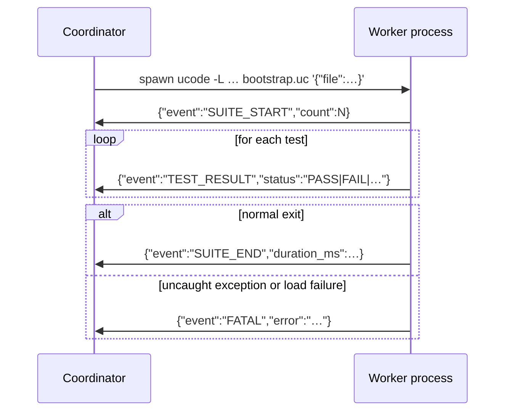
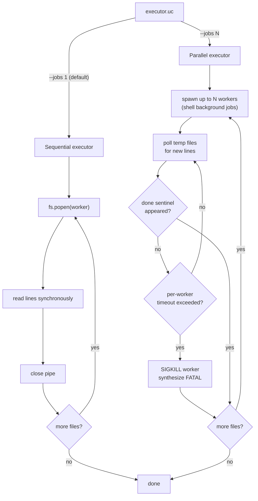

# About the worker/coordinator architecture

utest runs each test file in a separate ucode subprocess. Understanding why, and
how the two sides communicate, makes it easier to reason about failures, timeouts,
and reporter output.

---

## Why subprocesses?

ucode has no threads and no exception isolation between modules loaded into the
same interpreter instance. If a test file crashes — an uncaught exception, a
`die()` call outside a test body, a corrupt global — the crash would take the
entire test run with it.

Running each file in its own subprocess means the blast radius of any single
failure is bounded to that file. The coordinator receives a FATAL event, marks
the file as errored, and continues with the remaining files. A crash in
`09_standard_shim_test.uc` cannot prevent `10_aftereach_guarantee_test.uc` from
running.

Subprocess isolation also gives each test file a clean address space. Global
variables, imported module state, and any monkey-patching done by one file
cannot bleed into another file's execution.

---

## How the coordinator discovers files

The coordinator is the process started by `src/utest/cli.uc`. It:

1. Parses bundle arguments from the command line (`[Name:]path`).
2. For each bundle, calls `utest.runner.discovery.find_files(pattern)`, which
   runs `fs.glob()` and sorts the results.
3. Passes the file list to `utest.runner.executor.execute_suites()`.

Before spawning any workers, the coordinator calls `MockManager.setup()` to
generate shim files for every module listed in `config.mocks`. The shim
directory is then prepended to every worker's `-L` search path.

---

## How workers are spawned and how output flows back

Each worker is a fresh `ucode` invocation:

```bash
ucode -L <shim_dir> -L <src_dir> -L <cwd> \
      src/utest/runner/worker/bootstrap.uc \
      '{"file":"...","filter":"...","bundle":"...","seed":...}'
```

`bootstrap.uc` receives the JSON argument, loads the test file with
`loadfile()`, then calls `worker_runner.run_tests()`. The worker reporter in
`src/utest/runner/worker/reporter.uc` writes JSON objects to stdout — one per
event, terminated by a newline. The coordinator reads those lines and routes them
to the coordinator-side reporter.



---

## Sequential vs parallel executor

The executor choice is made by `src/utest/runner/executor.uc` based on the
`--jobs` flag:

**Sequential** (`--jobs 1`, the default): opens each worker with `fs.popen()`,
reads lines from the pipe synchronously, closes the pipe before starting the
next worker. Output arrives in the order tests run. No temporary files are
involved.

**Parallel** (`--jobs N`): launches up to N workers simultaneously using shell
background jobs. Each worker's stdout is redirected to a temporary file in
`$run_dir/pipes/`. The coordinator polls those files in a loop, advancing a
byte offset as new complete lines appear. A `done` sentinel file signals that a
worker has exited. The coordinator enforces a per-worker wall-clock timeout
(default 60 seconds, configurable with `--timeout`); a worker that exceeds it
is killed with `SIGKILL` and a synthetic FATAL event is emitted.

The trade-off: sequential is simpler and produces interleaved output in a single
stream; parallel reduces total wall time for slow test suites but requires
polling and temporary storage.



---

## The FATAL event

FATAL is the "something went catastrophically wrong" signal. It can originate
from two places:

- **The worker itself** (`bootstrap.uc`): if `loadfile()` fails, or if the test
  file throws an uncaught exception during the module-level evaluation phase, or
  if `setup()` / `teardown()` throws. The worker prints the FATAL JSON line and
  exits with code 1.
- **The parallel executor** (coordinator side): if a worker exceeds its timeout,
  the executor synthesises a FATAL event without a corresponding line from the
  worker.

After a FATAL, that suite produces no TEST_RESULT or SUITE_END events. Reporters
count fatals separately from errors and failures, and the run exits with a
non-zero code if any fatals occurred.
