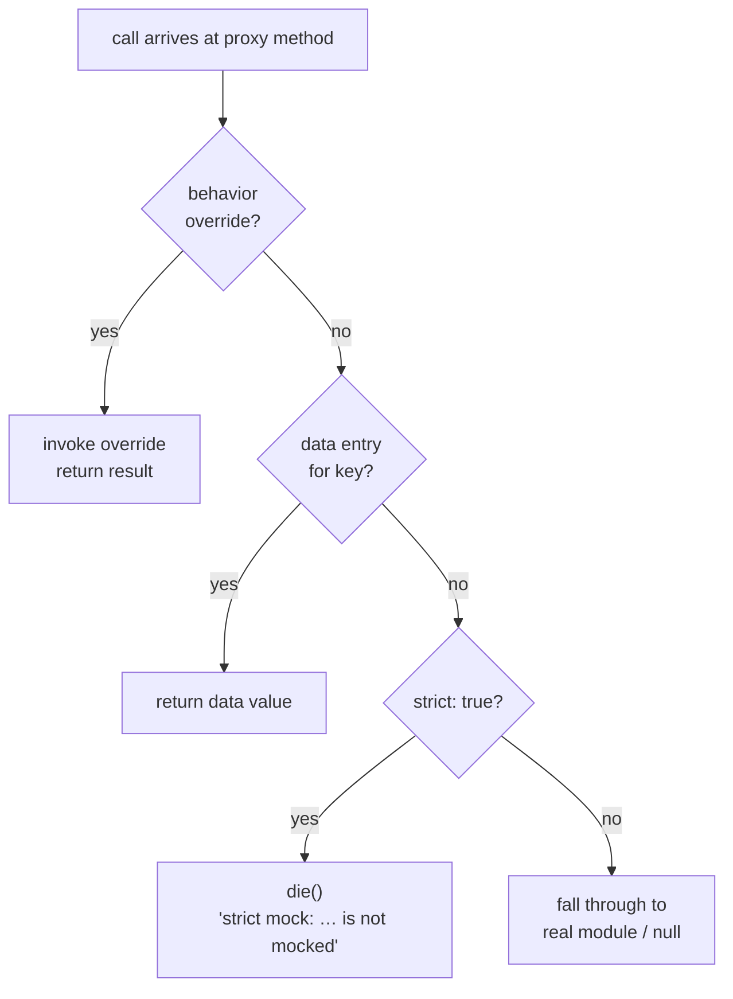

# How to write a custom proxy

Replace the built-in proxy for a module with your own factory so you can implement any mock behaviour the built-in does not support.

---

## Create the proxy file

Write the proxy as a ucode file in program mode (not ES-module mode). Return an object with a `create` function. The framework calls `create(name, real, ctx)` each time it builds a proxy for the module:

```js
// my_proxy.uc

return {
    create: function(name, real, ctx) {
        // Start from a base proxy that wires up behavior overrides and
        // passes unrecognised calls through to the real module.
        let proxy = ctx.base();

        // Override or add individual functions:
        proxy.my_function = function(arg) {
            // Check for a behavior override first:
            let f = ctx.get_behavior('my_function');
            if (f) return f(arg);

            // Look up seeded data:
            let value = ctx.get_data(arg);
            if (value != null) return value;

            // Enforce strict mode:
            if (ctx.is_strict())
                die("strict mock: '" + name + ".my_function' called with unmocked key: " + arg);

            // Fall back to the real module:
            return real ? real.my_function(arg) : null;
        };

        return proxy;
    }
};
```

---

## The ctx API

See [Proxy context API reference](../reference/contributor/proxy-ctx-api.md) for the full method list.

Every proxy method that handles a keyed lookup should follow this decision order:



This is the pattern used by all built-in proxies. See [About strict mode](../explanation/strict-mode.md) for a full explanation of why the diagram is shaped this way.

---

## Register the proxy in the config file

In the config file, pass `{ proxy: 'path/to/my_proxy.uc' }` as the value for the module. The path is resolved relative to the current working directory when utest is invoked:

```js
return {
    mocks: {
        'my_module': { proxy: 'test/proxies/my_proxy.uc' }
    }
};
```

The framework symlinks the file into place so `require('utest.mock.proxy.my_module')` finds your proxy before any built-in.

---

## Declare api for absent modules

If the module being mocked is not installed on the rootfs, the framework cannot introspect its functions to generate the shim. Declare an `api` array on the returned object listing all function names the shim should export:

```js
return {
    api: ['connect', 'send', 'close'],
    create: function(name, real, ctx) {
        let proxy = ctx.base();

        proxy.connect = function(host, port) {
            let f = ctx.get_behavior('connect');
            if (f) return f(host, port);
            let entry = ctx.get_data(host + ':' + port);
            return entry != null;
        };

        // ...

        return proxy;
    }
};
```

The `api` list drives shim generation when the real module is absent. Each name becomes an exported function in the shim that delegates to the global proxy when one is active.

---

## Use ctx.base() to inherit behavior override wiring

Calling `ctx.base()` returns a proxy where every function from the real module is already wrapped to check for a behavior override before falling through. Override only the functions you need to customise, and leave the rest on the base proxy:

```js
return {
    create: function(name, real, ctx) {
        let proxy = ctx.base();  // all real functions wrapped

        proxy.special = function(key) {
            let f = ctx.get_behavior('special');
            if (f) return f(key);
            let v = ctx.get_data(key);
            return v != null ? v : 'default';
        };

        return proxy;
    }
};
```

---

## Next steps

- Understand scoped vs global mocking: [How-to: Mock a module with mock.inject()](mock-inject.md)
- See where built-in proxies live in the source tree: [Reference: Source layout](../reference/contributor/source-layout.md)
- Fail on unmocked calls in your proxy: [How-to: Use strict mode](strict-mode.md)
