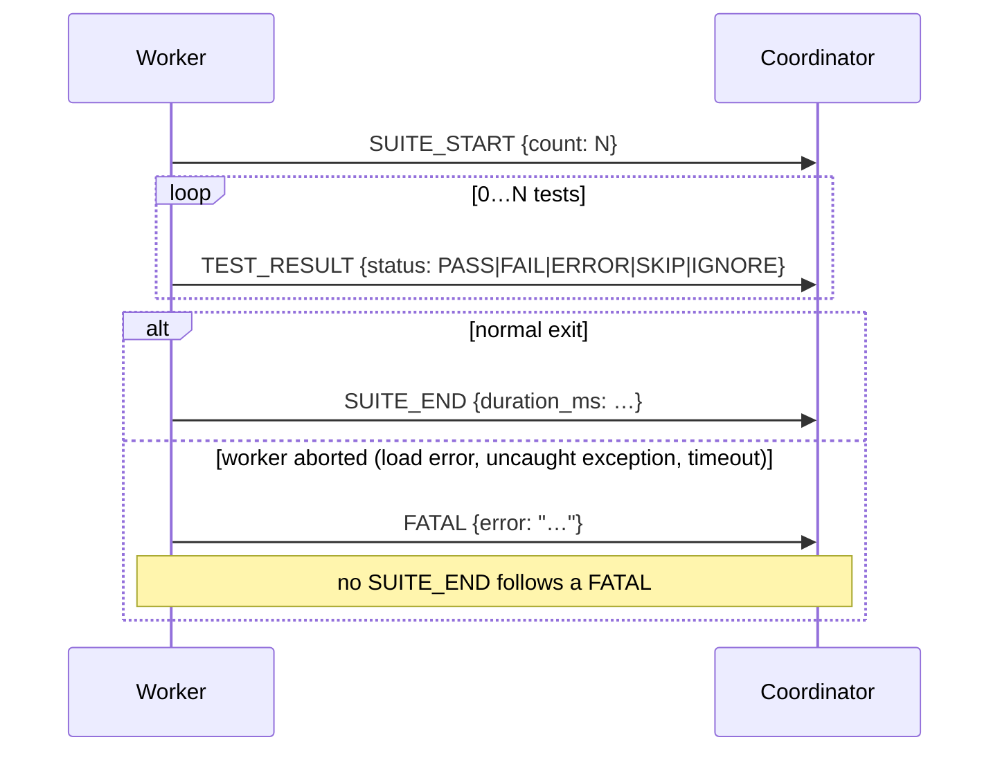

# Worker ↔ coordinator message protocol reference

Each worker subprocess writes newline-delimited JSON to stdout. The coordinator
decodes each line through the shared stream decoder (`make_stream` in
`src/utest/runner/executor/base.uc`) and routes recognised protocol events to
the appropriate reporter method via `dispatch()`.

A line is dispatched only if it is a well-formed protocol event — an object
with a known `event` and every field that event's reporter dereferences (see
`is_event`; a `TEST_RESULT` must carry a known `status` and a non-empty `path`
of `{id, name}` objects). Anything else — non-JSON output, valid JSON that is
not an event object, or a malformed event — is echoed to stderr and captured
as diagnostics for the terminal FATAL message, never dispatched. This keeps a
test's own stray stdout from being mistaken for a protocol event.

---

## SUITE_START

Emitted once per worker, before any test results. Carries the total count of
tests that will run (after filter and skip evaluation).

**Fields**

| Field | Type | Description |
|---|---|---|
| `event` | string | `"SUITE_START"` |
| `suite` | string | Absolute or relative path to the test file |
| `bundle` | string | Name of the bundle this file belongs to |
| `count` | integer | Number of tests that will produce a result in this suite |

**Example**

```js
{"event":"SUITE_START","suite":"examples/unit/01_assertions_test.uc","bundle":"examples/unit/01_assertions_test.uc","count":4}
```

**Coordinator action:** `reporter.suite_start(msg)`

---

## TEST_RESULT

Emitted once per test, in shuffle order.

**Fields**

| Field | Type | Description |
|---|---|---|
| `event` | string | `"TEST_RESULT"` |
| `suite` | string | Path to the test file |
| `bundle` | string | Bundle name |
| `status` | string | One of `PASS`, `FAIL`, `ERROR`, `SKIP`, `IGNORE` |
| `error` | string \| null | Failure message when status is `FAIL` or `ERROR`; `null` otherwise |
| `path` | array | Ordered list of `{id, name}` objects from root group to the test itself |
| `index` | integer | Stable insertion-order index of this test within its suite |

**`status` values**

| Value | Meaning |
|---|---|
| `PASS` | Test body completed without calling `die()` or throwing |
| `FAIL` | `die()` was called (assertion failure); `error` is the message string |
| `ERROR` | An unexpected exception was thrown; `error` is the exception string |
| `SKIP` | Test was declared with `skip()` or `xit()` |
| `IGNORE` | Test path did not match the `-f` filter regex |

**`path` element**

| Field | Type | Description |
|---|---|---|
| `id` | integer | Node identifier; `0` denotes the implicit root group |
| `name` | string | Display name of the `describe` group or `it` block |

**Example**

```js
{
  "event": "TEST_RESULT",
  "suite": "examples/unit/01_assertions_test.uc",
  "bundle": "examples/unit/01_assertions_test.uc",
  "status": "PASS",
  "error": null,
  "path": [
    {"id": 0, "name": "root"},
    {"id": 1, "name": "Assertions"},
    {"id": 2, "name": "checks for deep equality with assert.match()"}
  ],
  "index": 1
}
```

**Coordinator action:** `reporter.test_result(msg)`

---

## SUITE_END

Emitted once per worker, after all TEST_RESULT events.

**Fields**

| Field | Type | Description |
|---|---|---|
| `event` | string | `"SUITE_END"` |
| `suite` | string | Path to the test file |
| `bundle` | string | Bundle name |
| `duration_ms` | integer | Wall-clock time in milliseconds from suite start to suite end |

**Example**

```js
{"event":"SUITE_END","suite":"examples/unit/01_assertions_test.uc","bundle":"examples/unit/01_assertions_test.uc","duration_ms":3}
```

**Coordinator action:** `reporter.suite_end(msg)`

---

## FATAL

Emitted when the worker process itself fails — typically an uncaught exception
during test file loading, or a `setup()` / `teardown()` failure. After a FATAL
the suite produces no TEST_RESULT or SUITE_END events.

Both executors also synthesise a FATAL (without a corresponding worker event)
when a worker exceeds the configured timeout, via the shared `terminal_fatal`
logic. The parallel executor synthesises one further FATAL, marked
`aggregate`, if the whole run is interrupted (e.g. `^C`) before every worker
finished; reporters must not count an aggregate FATAL toward the suite total,
since it names a pseudo-suite (`<parallel run>`), not a real file.

**Fields**

| Field | Type | Description |
|---|---|---|
| `event` | string | `"FATAL"` |
| `suite` | string | Path to the test file (or `<parallel run>` for an aggregate FATAL) |
| `bundle` | string | Bundle name |
| `error` | string | Human-readable description of the failure |
| `aggregate` | bool | Present and `true` only on the run-interrupted FATAL; tells reporters not to count it as a suite |

**Example**

```js
{"event":"FATAL","suite":"examples/unit/06_imports_test.uc","bundle":"examples/unit/06_imports_test.uc","error":"Could not load test file: examples/unit/06_imports_test.uc"}
```

**Coordinator action:** `reporter.fatal(msg)`

---

## Event ordering guarantee

Within a single suite the coordinator always receives events in this order:

1. `SUITE_START` (exactly once)
2. `TEST_RESULT` (zero or more, in shuffled test order)
3. `SUITE_END` (exactly once) — **or** `FATAL` if the worker aborted early

When `jobs` (from `utest.config.uc`) is greater than 1, whole suites may arrive
in any order, but a single suite's events are never interleaved with another's:
the parallel executor feeds each worker's entire output to the decoder in one
callback, so a suite's `SUITE_START` … `SUITE_END`/`FATAL` run always arrives
contiguously. Reporters still key per-file state on the `suite` field, but they
do not need to handle interleaved events from concurrent workers.


