# Source layout reference

The diagram below shows how the major components relate at runtime. The coordinator spawns workers and aggregates their output; workers run test files in isolation and emit JSON events.

```mermaid
graph TD
    CLI["cli.uc\n(entry point)"]
    RUNNER["runner.uc\n(coordinator)"]
    MOCK["mock/manager.uc\n(shim generator)"]
    EXEC["runner/executor.uc\nsequential | parallel"]
    CREPORTER["runner/reporter.uc\n(coordinator reporter)"]
    WORKER["runner/worker/bootstrap.uc\n(subprocess)"]
    WRUNNER["runner/worker/runner.uc\n(test executor)"]
    WREPORTER["runner/worker/reporter.uc\n(JSON emitter)"]

    CLI --> RUNNER
    RUNNER --> MOCK
    RUNNER --> CREPORTER
    RUNNER --> EXEC
    EXEC -->|"spawns"| WORKER
    WORKER --> WRUNNER
    WRUNNER --> WREPORTER
    WREPORTER -->|"JSON events\nstdout"| EXEC
    EXEC --> CREPORTER
```

---

## `src/`

| Path | Responsibility |
|---|---|
| `src/utest.uc` | Public entry-point. Re-exports `describe`, `it`, `skip`, `xit`, `xdescribe`, `beforeEach`, `afterEach`, `setup`, `teardown`, `mock`, `assert`, `prop`, `forall`, `gen`, `is_generator`. |
| `src/utest/dsl.uc` | Implements the test-definition DSL (`describe`, `it`, `beforeEach`, …). Builds the in-memory tree of groups and tests in the worker process. |
| `src/utest/assert.uc` | Exports the `assert` object (`throws`, `match`). |
| `src/utest/combinators.uc` | Exports all combinator factories: `equals`, `contains`, `truthy`, `falsy`, `not`, `pred`, `regex`, `any`, `any_order`, `starts_with`, `ends_with`, `has_length`, `between`, `is_type`. Also exports `is_combinator()` used internally by `assert.uc`. |
| `src/utest/cli.uc` | Command-line entry-point. Parses `ARGV`, merges config file with CLI flags, resolves bundle patterns, calls `utest.runner.run()`. |
| `src/utest/runner.uc` | Coordinator orchestration: discovers files per bundle, invokes `MockManager.setup()` to generate shims, creates the reporter, runs execution loop, calls `reporter.summary()`. |
| `src/utest/runner/discovery.uc` | Wraps `fs.glob()` with sort; returns the list of matching test files for a pattern. |
| `src/utest/runner/executor.uc` | Factory: chooses `sequential` (jobs == 1) or `parallel` (jobs > 1) executor. |
| `src/utest/runner/executor/base.uc` | Shared executor logic: `build_l_flags()` (constructs `-L` search path arguments), `dispatch()` (routes JSON events to reporter methods), `ExecutorBase.execute()` (shuffles files before delegating to `run()`). |
| `src/utest/runner/executor/sequential.uc` | Single-worker executor. Opens each worker with `fs.popen()` and reads JSON lines synchronously. |
| `src/utest/runner/executor/parallel.uc` | Multi-worker executor, driven by `uloop` (no polling). Spawns workers with `uloop.process`, reads each worker's output file once at exit, enforces a per-worker `uloop.timer` timeout, and kills a timed-out worker's process group (`setsid` + `kill -9 -PGID`). Requires the `uloop` module. |
| `src/utest/runner/reporter.uc` | Reporter factory. Maps the `-r` format string (`detailed`, `compact`, `json`) to the appropriate module and calls `reporter.init()`. |
| `src/utest/runner/reporter/base.uc` | `ReporterBase` prototype. Accumulates stats, failure lists, and timing; calls `render_*` hooks if they exist on the concrete reporter. |
| `src/utest/runner/reporter/detailed.uc` | Detailed (default) reporter. Prints one line per test with status label and error text. |
| `src/utest/runner/reporter/compact.uc` | Compact reporter. Prints one dot per test, buffers failure details, prints them at bundle end. |
| `src/utest/runner/reporter/json.uc` | JSON reporter. Suppresses all intermediate output; emits a single JSON object at summary time (used by the regression suite). |
| `src/utest/runner/reporter/colors.uc` | ANSI colour constants and `color()` helper. Used by `detailed` and `compact`. |
| `src/utest/runner/worker/bootstrap.uc` | Worker entry-point. Receives a JSON argument from the coordinator, `loadfile()`s the test file, calls `run_tests()`. Emits a FATAL event and exits with code 1 on any uncaught exception. |
| `src/utest/runner/worker/registry.uc` | Holds the mutable `root` group tree that the DSL populates as the test file is evaluated. |
| `src/utest/runner/worker/runner.uc` | Flattens the group tree, applies shuffle, runs `beforeEach`/`afterEach` hooks, calls the test body, snaps and restores mock state between tests, dispatches status to the worker reporter. |
| `src/utest/runner/worker/reporter.uc` | Worker-side reporter. Serialises SUITE_START, TEST_RESULT, SUITE_END, and FATAL events as JSON lines to stdout. |
| `src/utest/mock/engine.uc` | Core mock engine. Owns `global.__utest_registries` and exposes `mock` (inject, global.patch/unpatch, snapshot, restore, reset) and `__internal__` (get_channel, set_channel, get_all_channel_keys, get_data, set_data, get_fn, is_active, is_strict, get_all_data_keys, get_proxy_global). Each registry tracks a `channels` list; proxies declare extra channels beyond `'data'` via a `channels` array on the factory object. |
| `src/utest/mock/manager.uc` | Shim generator. Called by the coordinator before any worker starts. For each mocked module: finds the real module, writes a shim `.uc` file, symlinks the real module as `real_<name>`, creates stub shims for absent modules with `api` lists. |
| `src/utest/mock/proxy_base.uc` | Provides `proxy_base.context(name, real)` which returns the `ctx` object injected into every proxy `create()` call. Exposes generic channel methods (`ctx.get`, `ctx.set`, `ctx.all_keys`) and `'data'`-channel shorthands (`ctx.get_data`, `ctx.set_data`, `ctx.get_all_data_keys`). Also provides `make_behavior_fn()` used by `ctx.base()`. |
| `src/utest/mock/proxy/fs.uc` | Built-in proxy for the `fs` module. Declares `channels: ['commands']`. Implements data-driven `readfile`, `writefile`, `open`, `access`, `stat`, the read-side family (`lstat`, `readlink`, `realpath`, `opendir`), `rename`, `unlink`, `mkdir`, `chmod`, `error`, `lsdir`, `glob` (all via the `data` channel) and `popen` (via the `commands` channel). Seals the destructive ops it does not model (`rmdir`, `symlink`, `chown`, `chdir`, `mkdtemp`, `mkstemp`) so they die under an active mock instead of hitting the real fs. |
| `src/utest/mock/proxy/uci.uc` | Built-in proxy for the `uci` module. `cursor()` returns an object with data-driven `load`, `get`, `get_all`, `foreach`, `set`, `commit`, `save`, `delete`. `get_all` injects `.name` (section name) into the returned object. |
| `src/utest/mock/proxy/ubus.uc` | Built-in proxy for the `ubus` module. `connect()` returns an object whose `call()` method looks up `"<object>:<method>"` or `"<object>"` in mock data, and whose `disconnect()` is a recorded no-op. |
| `src/utest/mock/proxy/uloop.uc` | Built-in proxy for the `uloop` module. Declares `api: ['init','timer','run','end']`. `timer()` queues callbacks; `run()` drains the queue synchronously. |
| `src/utest/mock/proxy/uclient.uc` | Built-in proxy for the `uclient` module. Declares `api: ['new']`. `new()` returns a client object whose `request()` drives the callback sequence from mock data. |
| `src/utest/property.uc` | Property-based testing engine. Implements `forall` (random generation, shrinking, persistence) and `prop` (DSL wrapper that auto-derives `persist_id` from file and describe path). |
| `src/utest/generators.uc` | Generator library. Exports the `gen` object containing all generator factories (`int`, `bool`, `float`, `string`, `ascii`, `alphanumeric`, `array`, `tuple`, `record`, `oneof`, `frequency`, `elements`, `constant`, `optional`, `map`, `bind`, `filter`). Also exports `is_generator`. |
| `src/utest/util.uc` | Internal utilities: `shuffle()`, `q()` (shell quoting), `format_path()`, `mkdir_p()`, `mono_clock()` / `elapsed_ms()` (monotonic timing), `seed_from_clock()`. |

---

## `test/`

| Path | Responsibility |
|---|---|
| `scripts/meta-test.sh` | Regression harness entry-point. Iterates over `examples/*_test.uc`, resolves companion config files, invokes `test/verify.uc` inside Docker. |
| `test/verify.uc` | Single-file verifier. Runs one example with the json reporter, compares output against the stored baseline JSON, prints PASS or FAIL. |
| `test/util.uc` | Shared utilities for the test harness (not for test files). |
| `test/json/unit/` | Baseline JSON files for unit example tests, one per `examples/unit/*_test.uc`. |
| `test/json/integration/` | Baseline JSON files for integration example tests. |

---

## `examples/`

| Path | Responsibility |
|---|---|
| `examples/unit/` | Example unit test files (`NN_<topic>_test.uc`) and their companion config files (`NN_<topic>_config.uc`). Serve as both documentation and regression targets. |
| `examples/integration/` | Example integration test files that exercise parallel execution and timeouts. |
| `examples/multi/` | Two files verified as a multi-bundle / parallel run (no per-file baseline). |
| `examples/timeout/` | Fixtures for the worker-timeout and process-group-kill checks (a passing suite plus hanging / grandchild-spawning suites). |
| `examples/envprobe/` | Env-passthrough fixture, run under both `-j1` and `-j2`. |
| `examples/requireshadow/` | Fixture proving a same-named sibling file does not outrank a configured module. |
| `examples/loadfail/` | A file that fails to compile, verifying a clean FATAL (not a runner stack trace). |

The last five directories carry no per-file JSON baseline; each is verified by a dedicated block in `scripts/meta-test.sh`.
